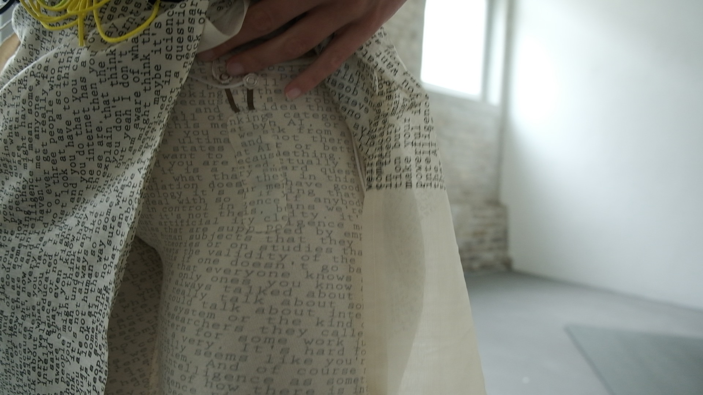
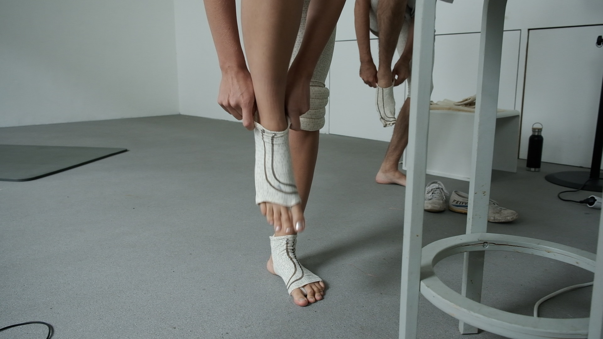
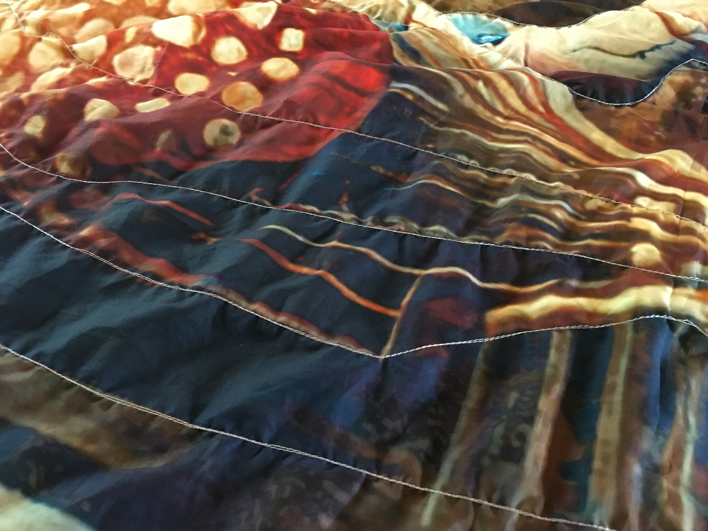
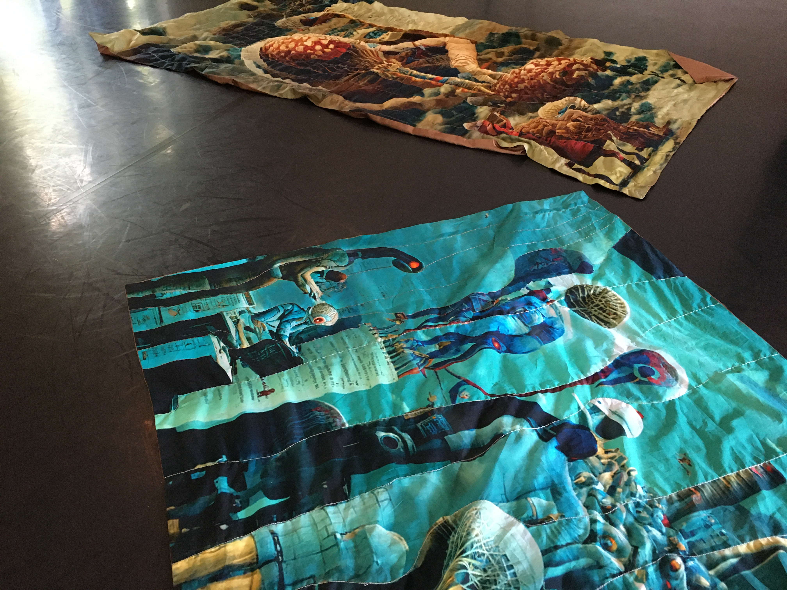
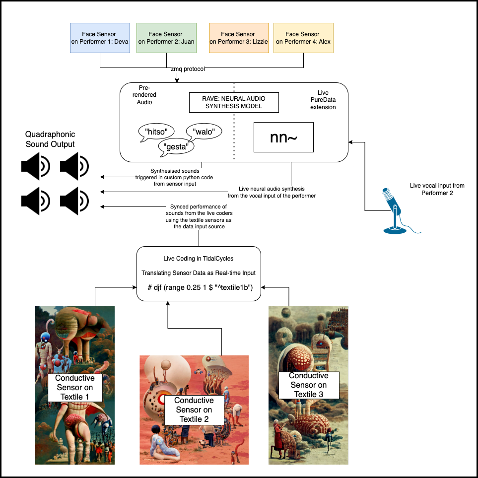

---
# This template is licensed under a Creative Commons 0 1.0 Universal License (CC0 1.0). Public Domain Dedication.

title: "MosAIk: staging contemporary AI performance - reflections on connecting live coding, e-textile and movement…"
author:
  - name: Elizabeth Wilson
    affiliation: Queen Mary, University of London
    email: elizabeth.wilson@qmul.ac.uk
  - name: Deva Schubert
    affiliation: 
    email: deva.schubert@gmx.de
  - name: Mika Satomi
    affiliation: 
    email: mika@kobakant.at
  - name: Alex McLean
    affiliation: Then Try This
    email: alex@slab.org
  - name: Juan Felipe Amaya Gonzalez
    affiliation: 
    email: info@jfag.co
abstract: |
  This paper introduces our collective work “Patterns in between intelligences", a performance piece that builds an artistic practice between live coding sounds and coding through dance, mediated and shaped through e-textile sensors. This creates a networked system of which both live coded processes and human bodies are part. The paper describes in detail the implementations of technology used in the prototype performance performed at No Bounds Festival in Sheffield UK, October 2022, as well as discussions and concerns the team had related to the use of AI technology on stage. The paper concludes with a narrative reflection on the Sheffield performance, and reflections on it.
fontsize: 11pt
geometry: margin=2cm
fontfamily: libertine
fontfamily: inconsolata
mainfont: Linux Libertine O
monofont: Inconsolata
bibliography: references.bib
...

# Introduction

The project began in September 2020 as a response to a funding call by the 'LINK masters' initiative to produce an artistic work using Artificial Intelligence. Our multidisciplinary team: choreographers and performers, live coders and e-textile makers gathered together to strategise how AI could inform an artistic performance work, both in terms of the concepts from AI that could be explored through the work, and how AI tools could be explored to realise the work.

In terms of AI concepts, we wanted to challenge mainstream ideas of AI, such as the emulation of human neural pathways as the method of creating new intelligences. Instead, we decided to take a collective view of intelligence. In developing an approach to performance we created a framework of our own ritual, to call into question the spiritual and social dimension of AI, and to connect machine learning with patterning techniques informed by ancient traditions. In terms of tools, a wide range of technologies have been branded as AI. Accordingly we have explored a range of techniques, with some focus on machine learning, machine listening and neural audio synthesis.

By treating intelligence as collaborative, we undermine the dualist thinking of body/mind as well as science/fiction, and open ourselves for a more human-centric approach to AI, in terms of pattern generation, pattern recognition and connectedness, but also resonance, textility, perhaps even spirituality. Inspired by public ceremonies and formalistic celebrations performed by humans since ancient times, the final performance hosts a collective, healing ritual that searches for a new spiritual code.

# [Background] Establishing rituals

An ephemeral shift at the end of the 19th century saw advancements in science and technology that provoked interest in mystical practices, rituals and spirituality – sounds emerged from mysterious boxes, light could appear inside a small glass bulb, and photography and cinema pushed the boundaries of art and technology.  Discourse in occultism augmented as an antithetical practice to the emerging technologies of the era. 

Our contemporary relationship with mediating intelligence has led us to once again explore esoteric practices to decipher wider meaning from our developments in AI.  People are turning to AI in a monotheistic way in the same way that earlier generations turned to religion. Musings on AI in the media are mostly prone to using the singular noun “an AI”- resonating with Western monotheistic cultural practices. 

The project attempts to establish a ritual, which aims to turn the singular noun variant of “an AI” into its counterpoint- “artificial intelligence”. An intelligence that is not centred in a small plastic case, or a human or animal body, but instead as something animalistic, distributed across many spirits and all encompassing.  

# Live data flows and time travel

Throughout our project we have jumped between imagining rituals and creating technical systems, with it not always being clear which is which. For example, as collaborating e-textile, live coding and performance artists, working together required us to establish meaningful dataflows and protocols for collaboration, which we could also characterise as channels for carrying resonances between us. 

The development and refinement of these custom technologies was crucial in establishing the way we could interact. A core problem was how to connect moving bodies with comparatively static actions of live coders, typing at their laptops. With battery-powered e-Textile sensors capturing movements and interactions with the textile surfaces, and wireless networking acting as conduit, several problems around how to interpret and respond to the data flows remained.

We focussed on our technological constraints as creative material, and one such constraint was the delay or latency in our systems. There were several steps in the processing and transmission of sensor data, starting with the sensors themselves and the use of machine learning in reducing the sensed dimensions. The most significant cause of latency came from our use of the TidalCycles live coding system, however. By default, for compatibility with low-powered hardware, Tidal adds a delay of over 0.2s. This can be tuned to be much lower, but further significant delay comes from the way that Tidal events are placed on metrical cycles. In summary, both due to inherent delays and the way we use Tidal to generate patterns, there could be a delay approaching half a second before a live coder's work could connect a sensed movement into a sound triggered by it. Human perception is tuned to the speed of sound [@chafe2010effect], so that any delay between seeing an action and hearing the result is perceived as distance. Such a half-second delay therefore translates to 171.5 metres, significantly dissociating the movement and the result.

We approached this delay creatively, in three different ways. One approach was to use the sensor in ways other than triggering sounds (which can in any case be perceived as *too* direct, and heard as 'mickey mouse' style soundtracking). When applied to pattern transformation or synthesis parameters, the movements shaped the music in a less direct but still fundamental and tangible way. Another was to reduce the latency for the interactions that did not involve live coding. For example, sounds triggered from sensors placed on the faces of the four performers were directly translated into sound with a custom Python code according to simple 'counting' patterns. With different performers triggering sounds at different rates, this counting created polymetric interference patterns.

However for live coding interactions, we found a third, perhaps counterintuitive approach to working with live sensor data. Rather than minimising the delay, we instead explored increasing and compounding it. This relied on ideas of patterned repetition and resonance that were already a recurring theme in our discussions and collaborative work. For example, where the piece worked within a metric cycle of 1.4 seconds, and we found a latency of 0.4 seconds, to keep everything in time, we simply had to delay the signal for an additional 1 second. On top of this we added additional data 'echoes' of additional cycles, by applying a cycle-length delay line to the data signal, with feedback. As a result, repetitive movements fit perfectly to the metric cycle, and built up and dissipated over time with the introduction and breaking of the repetition.

# E-textile Sensors and magic spells

E-Textiles create soft and flexible sensors that are worn on the body to sense movements. For this performance, we explored e-Textile pressure sensors [@kobakant2009] made of Eeontex stretch resistive fabric to sense bend and stretch of garments caused by body movements. Embroidered capacitive sensors were also used to detect touch or fold of fabric surfaces.  In early prototypes, we focused on pressure sensors placed proximate to the body, for example embedded in tightly worn stretchy clothing, to detect bend/stretch movements of the performers. We used a Bela mini board which allowed us to read up to 8 analog sensors per performer and 1) directly trigger sound from a single sensor data, 2) process multiple sensor data with machine learning to be used as a reduced number of synthesis parameters. We used ml.lib [@ml-lib] externals on Pure Data [@PureData] open source software. E-Textile pressure sensors placed proximate to the bodies capture precise movements well enabling the system to recognize repetitions. However for the performers, these sensors create the notion of "activation points", which tend to become unwanted frameworks when choreographing new movements. 

In the later prototypes, we moved on to use conductive thread embroidery on large textile surfaces (140cm x 280cm, 140cm x 140cm) which function as capacitive touch sensors. We used them as 1) direct trigger of a sound, 2) to create data patterns that influence live coding patterns. When used in this way, the textile sensors capture relative positions of the textile surface in relation with the performer’s body. 

When the data mapping is indirect with the sound outcome, we observed that the onlookers are likely to misunderstand the correspondence and it tends to give an impression that they are not interactive.  Currently we are evaluating above e-Textile sensor designs to decide for the final design strategies, including how we use the data in the live coding processes.

## Machine Learning and e-Textile sensors

In our first prototype, we used eight e-Textile pressure sensors on performers’ bodies capturing every 40 milliseconds, streaming the data simultaneously. These raw data are difficult to use as control parameters, while one needs to monitor many sensors at once to make sense of the incoming information. Reducing the dimensions of data using machine learning became our practical solution. E-textile sensors often show hysteresis and wear-and-tear as it is in continuous use and require one to make fine tuning in process. Instead, assigning posture as pattern of data and training the machine learning system reduces the necessity of manual tuning. We observed this approach provides smoother and more intuitive interaction between the wearer and the interactive system

{ width=70% }

{ width=70% }

## Materialising AI-Generated Images 

We used Disco Diffusion [@DiscoDiffusion] AI image generator to produce a series of images with prompt texts composed of keywords taken from the conceptual investigations, in order to create pattern design for large scale digital print fabrics. Although a human designer created a description of the image, reference style of drawings and an initial image to influence compositions and the colour scheme, the main "drawing" of the pattern is made by AI. Generally, AI-generated images make mistakes in continuity of the space or geometry, which work against the overall composition. Sometimes it generates strange associations of image with prompt texts, that gives us a new, creative idea or sensation. It is like a deformed mirror that reflects our interpretations and associations of things. These AI image generation tools can produce many variations of images in a relatively short time and can inspire the creative process of a designer. But in the end, we found this is not a 'hands-off' process. A human designer needs to create their own interpretations and compositions for these images, through hand-editing and collage, in order to complete it as an artistic piece. In this sense one can say "artificial intelligence" is a powerful creative support tool for us humans to make use of, but it is not creative on its own.

{ width=70% }

{ width=70% }

# Artificial Voices and Warped Sounds 

TidalCycles was the main software used for live coding sounds  [@mcleanMakingProgrammingLanguages2014], however a few custom elements were employed to alter the territories that live coders were used to, pushing them into new modes of interacting with sound through software. The two live coders were tasked with working independently when manipulating sensorial information from the materials but also collaboratively in response to each other, to create a unified sound world. 

At the exposition of the piece, data from the sensors on the face of the four performers was sent using the zero-mq (zmq) protocol [@hintjens2013zeromq]. In this, the sensors’ were thresholded so that the movement of opening of the mouth would lead to different sounds being triggered. A custom python script would receive the trigger messages once above the threshold, and play back a sample. The face sensor was then continuously mapped to sample volume, so that the amplitude envelope of the sound could be shaped or shortened with the mouth.  Each performer was assigned a unique set of sounds that would be triggered from their sensor. The sounds that were triggered were made using an artificial voice, and the outcome of this was to create a set of words that were nonsensical, but through their repetition and cycling through the sound set would give the impression of a “counting” sequence. This sequence was reduced from six to two sounds during this part of the piece, creating tighter loops and a greater sense of patterned interplay between the performers. To create the sounds from an artificial voice, we used a Neural Audio Synthesis model called RAVE [@caillon2021rave].  In short, this uses a variational autoencoder (VAE) structure but is applied as a real-time model (able to generate 48kHz audio signals, while simultaneously running 20 times faster than real-time on a standard laptop CPU).  The RAVE-model is trained on a corpus of audio and the VAE structure decodes and then encodes the signals. The process of “timbre-transfer” [@caillon2021rave] allows interpolation of the latent space based on input source sounds. These input source sounds can be either audio files, or live input from a microphone.   

As well as being used to create a set of unique sounds to be triggered by the opening movement of the mouth from the face sensors, the RAVE model was also used for real-time vocal synthesis. Live vocal input from a wireless microphone worn by one of the performers was passed to this real-time model, which was implemented as an extension for the PureData software. The real-time audio was fed into the model in input and warped into an artificial voice by traversal through the latent space. This allowed the manipulation of the human performer’s voice and reconstructed it as an artificial and synthetic voice.  

Finally, alongside the creation of artificial and vocable sounds, the live coders also worked with the sensor data from the fabrics that were manipulated through the performers’ movements to create music.  The data was also sent using the zmq protocol and through a custom script received as osc-input data for TidalCycles. This allowed the live coders to use the data to control aspects of the sound. 

Various strategies were used in the translation of the data into sound. One strategy that was employed by the live coders was to use the touch of the textile could as a variable within the code, to control the speed, pitch, gain at which sounds were played back or adjusting the parameters of an audio effect applied to the pattern. This made the relationship between sound and gesture apparent to the audience. When adjusting some of the parameters, such as the perceptual loudness, it was also useful to logarithmically scale the sensor inputs. An example of this strategy shows how these features were implemented: 

 ~~~~ { .haskell} 
plyWith 4 (# speed "<0.5 2>")
    $ degradeBy "<0.25 0.36>" $ sound "<residue fluid>*8  # sus 0.4 # rel 0.4  # n (irand 64)
    # djf (range 0.25 1 $ "^textile1b")
    # gain (logBase 10 <$> range (1.6) (4) $ "^textile1a")
~~~~

Another strategy for performing with the sensors as the input source was to use the data to trigger particular patterns depending on how much interaction with the sensors embedded into the fabric occurred. This involved creating a threshold over which the sound would be triggered. This would allow the live coders to write various patterns and the patterns would then be triggered through the shifting of the touch. 

 ~~~~ { .haskell} 
do
  let textile i = (cR 0 ("textile" ++ show i))
  let thresh = 0.7
  d1
    $ sometimes (plyWith 4 (# speed "0.25"))
    $ stack [
      mask ((> thresh) <$> textile 0) $ sound "~ <sfe:4*2 sfe:8> [~ glitch] ~", 
      mask (( >thresh) <$> textile 1) $ gain "0 1 0 [0 1] [0 1] 0 1 1" # sound "cckit1"   # n (irand 8),	
      mask (( >thresh) <$> textile 2) $ sound "[~ hh] [~ hh]? [~ hh] [~ hh]?",
      mask (( >thresh) <$> textile 3) $ sound "cubic:7/2"
    ]
~~~~
Through these strategies we found that the live coders’ fingers were relieved from the burden of typing where the performers bodies became a new input source to update and shape the code in real-time. 

Overall, the top down view of how the piece came together in performance and how the different sounds combined can be seen in the figure below. 

{ width=80% }

# Staging AI

As we started off with responding to the call for AI in creative practices, we looked into how we can incorporate AI technology in our collaborative works. We often discussed whether we treat AI as a tool or whether it plays a role as a subject matter.

Here are some of the discussions we explored: 

* AI is a “difficult” subject matter - AI is widely discussed and criticised in our society, and we have certain expectations of AI technology, how it looks and what it does, such as what we see in science fiction. This makes it complex to stage AI if you do not want to "fake" the technology, especially in a non-text based (i.e. not narrative theatre) performance piece.
* AI tools accessible for creative coders are limited and do not live up to what we know from popular science. On the other hand, it is not our intention to make the piece as a cutting-edge technology demo. We do not want to be an artistic 'sweetener' for the newest AI technology showcase, but how do we meet the expectation of what we imagine as AI?
* Fighting with expectation of "stage magic" - For spectators, everything that happens on a stage is a spectacle. How do we show, or not show the technology behind our work, especially when technology is a subject matter? Our response to this is framed by our artistic team including proponents of live coding, open source and open hardware. Moreover, how can we be open about our work when AI is so associated with mysterious 'black box' technology?
* Distinction between live composition and audience attention and engagement - How to keep the action fresh and spontaneous while at the same time keeping the attention of the action focused? In a way AI technologies have more agency to make decisions live on stage but these decisions are barely noticeable unless you fall back to explaining them.

# What is "artificial intelligence" to pattern-makers?

To begin, a discussion of what "artificial intelligence" entails is offered. A generic definition is offered in the Oxford English Dictionary: 
    
> "Artificial intelligence: the theory and development of computer systems able to perform tasks that normally require human intelligence, such as visual perception, speech recognition, decision-making, and translation between languages" [@oxfordreference].

Alan Turing also famously considered the question "Can machines think?" in his seminal work Computing Machinery and Intelligence [@turing2009computing]. He asserts that, stated this way, the question is "too meaningless to deserve discussion". Moreover, the status of “intelligence” in Turing’s paper is never made specific and apart from in the title, the term only appears once, clearly referring to human intelligence, and the reader is generally invited to infer the relationship between "can...think" and "is intelligent." Many definitions of Artificial Intelligence are similarly embedded in terms of “things a human can or might do” (see [@bellman1978introduction] [@haugeland1985artificial]). From these definitions, what this means for live coders, e-textile artists and performers is considered, where each of these mediums deal with the expression of patterns. We ask- is a machine learning algorithm intelligent when intelligence is discussed in these terms? How about a choreographic system, or an electronic circuit woven into textile, do they qualify? Or perhaps do they still exceed the intelligence of a machine learning algorithm?  

The word 'intelligence' is perhaps even more problematic, when the history of measurements of intelligence (IQ tests) is wrapped in the racist ideology of the eugenics movement, what can we consider as “knowledge and skills” and what it means to “acquire and apply”?. Intelligence generally implies a separation from the mind and body as the definition in the dictionary already illustrates: as if the skills of bodily action are outside of the knowledge acquired in mind. While we should be careful in over-romanticising the history of handcrafts, we nonetheless argue that situating intelligence in craft practices demands a less dualistic approach, rather seeing intelligence of mind as inseparable from the intelligence of the body and indeed the collective intelligence of a community of practice.

While we incorporate contemporary tools in our systems that overtly describe themselves as AI and ML (machine learning) technologies, like dimensional reduction algorithms, pattern recognition systems and neural audio synthesis, one of our background interests in AI is in its relation to the 'heritage algorithms' of traditional pattern-making, in music and textile. In essence, many traditional approaches to pattern-making are a form of computational creativity. For example in weaving, the tie-ups of shaft looms combine binary sequences through matrix multiplication to create complex, three dimensional structures from simple treddling patterns. This creates very rich creative ground, supporting a traditional and continually evolving practice that still finds new structural techniques despite the technological development over millennia. This human-driven, computational pattern generation is a clear analogue to pattern recognition techniques in AI. A longer term challenge for our collaboration that brings together dance, e-Textile and code artists/technologists is to find ways to develop new technology that is respectful and (to some extent) literally interwoven with such heritage technologies, to create a properly grounded approach to AI.

# Sheffield prototype: Patterns In Between Intelligences

The first (and at the time of writing, latest) iteration of our live performance debuted at No Bounds Festival in Sheffield UK, as a prototype of the overall project. This performance provided the test bed to implement ideas in front of a live audience, and see how they shape the performance as a real-time feedback channel. A narrative account of the performance follows.

> This performance can be considered a site specific piece, as we brought together these elements but staged them specifically to achieve a close interaction with an audience that was present in a big church. Staging refers to the composition of the different elements and disciplines to achieve a whole thread or narrative based on the experience of the audience. In this case choreography with body movements and gestures, sounds and text produced by the human voice, and the overall hints at a stage situation were the main staging of the bodies and the objects.

> At the beginning the audience gathers in the church after purchasing their tickets and some drinks, the initial expectation of this audience relates to the specificity of this event and the location (an electronic music festival and a cathedral). The space was lit with cold light, but given the dimensions of the cathedral the background and surroundings of the center was very dark, hinting at the magnitude of the building. There was no sound, just the chatter of the audience was hearable. In the brightest part of the space, the area inside the columns, we see a textile hanging from a tripod, and some folded fabrics of a color similar to the floor. In the edges of this space and behind the area inside the columns we see other tripods, a desk with the sound and light technicians, a stage, as well as all the symbology and paraphernalia of a church.

> At some point a woman dressed in black with a sensor on her face and a headset microphone stands next to a group of audience members, gets close to them as if she was one of the visitors of the festival, she opens her mouth, triggering a loud voice sound that interrupts the silence, echoing throughout the cathedral. This sound disruption made the overall volume of the audience chatter lower for a moment, most of them were not aware of where it came from, it might just have been a sound checking error. The woman moves slowly within the group of audience members, some of them notice her presence. She suddenly opens her mouth again a couple more times, triggering the loud sound again. The overall volume of the chatter lowers and at some point the audience knows that something started, changing the mood in the space. At this point though, not everyone knows what is going on, as the woman is very much one of the many bodies present in space.

> She then goes next to a column and most people get to see how when she opens her mouth a sound is produced in the whole space. At some point other bodies, also wearing black clothes and face sensors join the space, some of them are next to the columns others in the background. At this point the sounds being produced happen more often and the relation between the gesture of some people wearing black clothes and sensors on their face becomes clear. The sounds voice recordings as if they were snippets of someone talking, murmurs, gibberish, and they repeat independently of who opens their mouth. The people producing the sounds gather next to the column of the space and at the distance they exchange looks, as if they were playing with the timing of when to open the mouths and produce sound, but also as if they were communicating in some way. They change positions and create different constellations, sometimes two of them come closer, sometimes they observe from a distance. The accumulation of the voice sounds becomes more and more present, but their gestures are simple and it contrasts with how they move around and space. It is a very mechanical and minimal sudden mouth movement.

> Then they gather next to the hanging fabric and the sounds and mouth movements become faster, as if you see a group of four people discussing something, the sounds they produce, these voice snippets overlap and accumulate filling the whole cathedral. Two of them then sit on the floor next to the laptops visible in the space and start typing something. The other ones do some more of the mouth opening gestures but now the way they walk and their interactions involve going towards each other and creating a spinning trajectory, walking and facing each other while they produce the sound. They smile and share a complicity between them as well as with the ones sitting on the computer as if they were plotting something in that space.

> At this moment somewhere far from the dark a buzzing sound is heard and from behind some of the audience out of the darkness we see a person wearing some kind of robe and holding a string attached to a small drone. The drone flies over the audience into the space and behind the columns and the person holding it looks very concentrated at it, sometimes the drones pull this person and they follow, other times it looks like the drone comes to them, you can't be completely sure who is controlling who. The person enters the area inside the columns and the drone goes to one of the folded fabrics on the floor, the wind it produces unfolds part of it and the attention of the other performers seem to be directed at that moment. The initial surprise of this figure that entered the space with a drone, wearing an outfit that is not black clothes and the fact that while the drone flies over the cloth, transforms this surprise into an intrigue and curiosity of what are these cloths that have been laying down all this time and a curiosity of what other figures might appear from the darkness of the cathedral. The figure with the drone leaves in the opposite direction, she takes off the robe and disappears behind the space into the darkness.

> A subtle sound is heard and still some of the voices from the beginning. At this point the woman that first appeared has all her attention directed towards the fabric on the floor and slowly walks towards it. She bends down and starts to unfold it, extending it on the floor. We see an image, similar to the one hanging on the tripod but in a different color. She looks at it and then kneels down to touch it and when she touches it a distorted and loud sound is heard. She caresses the fabric and the sound changes in accordance to how she moves her hand over the surface of the fabric. The sound also stops when she takes her hand away. She looks in different directions, reacting to something that happens every time she touches the fabric, and she  whispers some text as if she was talking to someone in the darkness or as if every time she touches the fabric it makes her speak. We just cannot understand what she’s saying because it’s fast, it’s being whispered, and the sounds (the background sound, the sound produced by touching the fabric, and the occasional voice sounds of the sensors grow louder and louder). The intensity of this interaction grows together with the movement of the person, the intensity of her whispers, and the intensity of the sound.

> While this is happening in the background one of the four bodies with the face sensors looks at this action and sees a fabric folded next to him. He approaches it and unfolds it, maybe inspired by what the other person is doing or maybe out of curiosity. We get a glimpse of another image in the fabric but this one is never fully extended on the floor. He then proceeds to wrap himself with it, wearing similar to the figure with the drone but never fully wearing it properly. He seems to be struggling with it, he seems to be feeling its texture, he seems to be stretching it around himself. His movements become more erratic and it looks like by wearing the fabric the way he moves got transformed by it. He is more in the background, in the space behind the columns, close to the audience. His gaze is directed towards the horizon and even though he gets very close to some audience members and in the outbursts of his sudden movements almost hit them, he is not really present but addressing something else in the space. He also moves his mouth as if he was mumbling something but he doesn't whisper like the other person. His movements grow more intense and erratic, as if being controlled by the sound, he goes inside the area of the columns.

> We see both bodies grow in intensity, the woman just opens another fabric and the whispering transforms into voice and body glitches. The sound intensity keeps on growing, it accentuates the speed and scope of the movements of the bodies (which also gradually grew) but also you are not sure if they are following the music or if it’s their bodies and the fabrics controlling the intensity. This moment grows and it becomes darker, from the repetition of these sounds and the movement vocabulary being repeated, the musical buildup becomes an intense techno moment. The two bodies that were interacting with the fabrics start extending all the other fabrics on the floor, revealing the images on them. Two other persons, one of them the drone figure, hang the remaining fabric on the tripod outside of the area with columns. The situation of how the bodies interacted with the fabrics, the whispers and the movements, as well as the kind of music they were building together transformed into a regular and repetitive beat and the space transformed into a display of a series of huge images, each one in a different color scheme and containing different figures, maybe related to the bodies we have seen.

> The two performers that extended the fabrics and have been interacting with them start doing a repetitive movement on top of them, spinning their torsos and arms and heads in synchronisation with the beat. Once the audience sees all the images and also supported by a stroboscopic light they seem to have entered a trance, enhanced by the techno as in a rave. At one point they collapse against the wall and move in slow motion against it. The audience gets the chance to appreciate the whole composition that all the fabrics produce together and the space becomes a club or rave space. One of the bodies gets stands, the loud music suddenly stops, and he approaches the audience and addresses them. He talks directly to the audience, very fast nd in close proximity.

> He says the following text: “I see mystical patterns amongst the noise. What is behind it all? I see five archetypes. I see the new age possessed jester of ai. I see the machine learning weaving of ancestral knowledge. I see the mother performing neural endurance rituals. I see the synthetic choir queen of information technologies. I see the pagan data center workers ritualizing spiritual cables. I see these five archetypes, and there is something behind them. It's like a bill. The worth is in the image printed on it and not in the paper itself. There is an intelligence behind all this! There is, there is! But who’s responsible for it? It’s not about the content, it is about the context.” You nevertheless cannot fully understand the content of his speech because it is very fast, he interrupts the amplification of it by opening his mouth, triggering the sound of the sensors, and he repeats some of the sentences, strangening the way the audience perceives the content. It looks like an attempt to explain what has just happened but distorted in such a way that it becomes more like a repetitive sound similar to the techno music that was just heard.

> The other body who is still laying on the floor starts to accompany this speech cacophony by contrasting it with a repetitive and slow singing in a high pitch. The voice seems to be distorted, we then realise that everytime she sings other voices appear through the amplified sound, since no one else is singing. The man talking leaves, continuing to talk but fading out in the darkness of the cathedral. The person singing also approaches the audience and sings close to them, we realise, in the proximity that there is a relation between her voice and the amplified voice intervals from the amplification. At one point she also leaves into the darkness. Her voice is still heard in the space in repetitive tones. After she leaves all the other music is also gone and her voice stays like a mantra. The people sitting on the laptops stand up and leave. We are only left with the voice and the emptiness of the room. After some cycles and repetitions we appreciate the emptiness of the room and the fabrics hanging or laying on the floor, we see other audience members staring into the space, and due to its length we revisit what just happened and how the initial space and situation transformed. At some point the final repetition of the mantra happens and the lights go out, leaving the audience in complete darkness.

#  Reflections 

The performance of “Patterns In Between Intelligences” was an exploration of new avenues of collaboration between the media of live coding, e-textiles and movement. Bodies manipulated fabrics, which in turn wirelessly fed the code with data to affect its outcome. However, in our performance we did not just hope to create these connections with each other. Beyond this, the piece also functions to achieve some wider aims, that looks to both critique contemporary uses of AI and also uphold a paradigm for a shared future with it.  

In particular, throughout the piece we wanted to reframe AI as both a practice rooted in tradition and esotericism, rather than a rationalist one from ‘cutting edge’ technological practices. AI is rapidly being expanded as the newest, and sometimes the sole focus, wing of the field technology. However, the etymology of the word “technology” holds its roots as the “systematic treatment of an art, craft or technique” [@etymology], where this in turn stems from the Greek word “tekhnē” meaning “art” or “craft”. Technology and craft practices are never ontologically as far from each other as we might assume. 

Moreover, this performance also explored how AI functions as a mirror for contemporary societal issues. If most current AI techniques are fed using corpuses of contemporary dataset (e.g.images, music) scraped from the internet, then perhaps we can think of it as a mapping of our contemporary and somewhat broken society. The internet can be treated as a metaphor or manifestation of what Jung refers to as the "collective unconscious" [@jung2014collected]. Common archetypes have sometimes begun to emerge through uses of artificial intelligence algorithms (such as the Disco Diffusion generation algorithms mentioned). These archetypes can veer towards caricatures- strong visual figures like Donald Trump, Mario, or Ronald McDonald are vivid and clear for everyone, but abstract and esoteric concepts like “gnosis” or “democracy” are less so. To open new vistas to alternative paradigms of society, the datasets and training should be emblematic of the world we wish to create, not the one we wish to grow beyond. 

# Acknowledgements 

This work was supported by the Volkswagen Foundation LINK masters Grant and the Fonds Darstellende Künste Foundation Grant. Additionally, Wilson’s contributions were supported by EPSRC and AHRC under the EP/L01632X/1 (Centre for Doctoral Training in Media and Arts Technology) grant and Alex McLean's contributions were supported by a UKRI Future Leaders Fellowship [grant number MR/V025260/1].

# References
